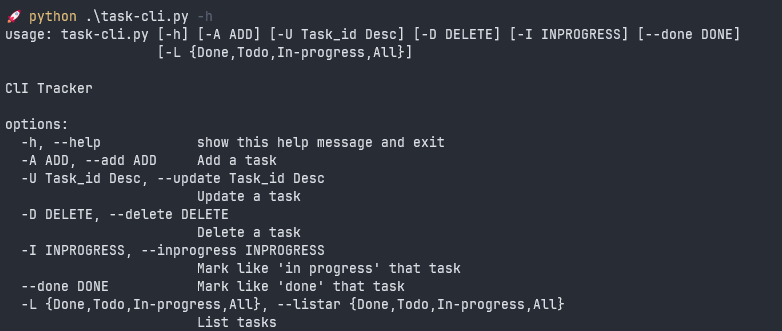

# Task-Tracker

This is a simple command line interface (CLI) to track what you need to do, what you have done, and what you are currently working on.

This is a solution based on the project of [roadmap.sh | Task Tracker](https://roadmap.sh/projects/task-tracker).

## Options

The application run from the command line, accept user actions and inputs as arguments, and store the tasks in a JSON file called 'tracker.json' and that JSON file stores the tasks in the current directory. The user be able to:

- Add, Update, and Delete tasks
- Mark a task as in progress or done
- List all tasks
- List all tasks that are done
- List all tasks that are not done
- List all tasks that are in progress

## Task Properties

- id: A unique identifier for the task
- description: A short description of the task
- status: The status of the task (todo, in-progress, done)
- createdAt: The date and time when the task was created
- updatedAt: The date and time when the task was last updated

## Help

If you write the following sentences, you will receive a quick help on how the application works



## How it works

```bash
# Add a task
python task-cli.py -A [Task Description]

# Update task
python task-cli.py -U [Task ID] [New Task Description]

# Delete Task
python task-cli.py -D [Task ID]

# Marking a task as in progress or done
python task-cli --inprogress 1
python task-cli --done 1

# Listing all tasks
python task-cli -L All

# Listing tasks by status
task-cli -L Tone
task-cli -L Todo
task-cli -L In-progress
```
